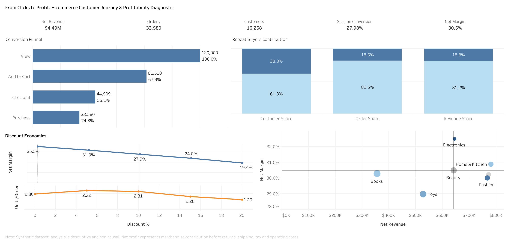
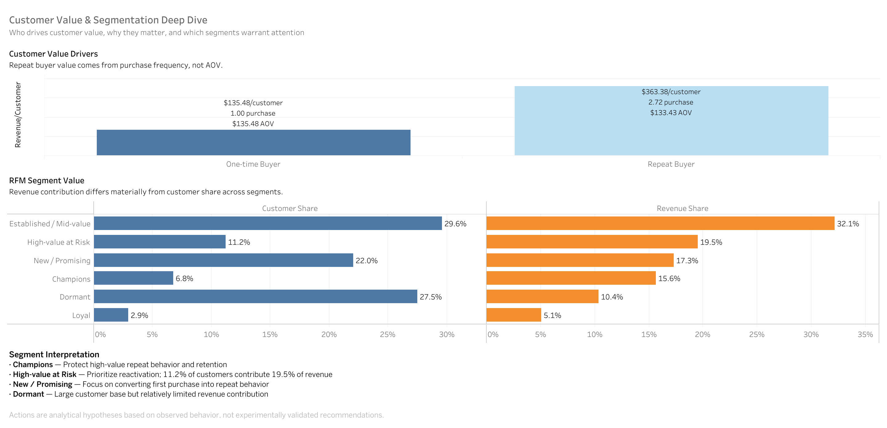

# E-commerce Customer Journey & Profitability Analysis

## Overview

This portfolio project analyzes a synthetic e-commerce customer journey from browsing through purchase, with a focus on conversion, repeat-buyer value, discount economics, and category profitability. The project also demonstrates why trustworthy business reporting depends on controlling analytical grain, defining metrics consistently, and reconciling results before presenting them in a dashboard.

The analysis is descriptive, not causal. Original exploratory work is preserved separately from the validated SQL, outputs, and Tableau dashboards.

## Business Questions

- Where are users lost in the conversion funnel?
- How much value do repeat buyers contribute?
- How do discount tiers relate to order economics and margins?
- Which categories balance revenue, margin, and customer review risk?
- Which RFM segments deserve attention?
- Which cohort and comparable-period patterns provide useful supporting context?

## Dataset

This project uses the following Kaggle dataset:

- **Dataset:** [E-commerce Transactions & Clickstream](https://www.kaggle.com/datasets/wafaaelhusseini/e-commerce-transactions-clickstream)
- **Creator:** Wafaa EL HUSSEINI
- **License:** CC BY-SA 4.0
- **Nature:** fully synthetic; used for analytics practice rather than as evidence about a real company or market

The seven source tables are:

| Table | Primary analytical role |
|---|---|
| `customers` | Customer attributes and registration data |
| `products` | Product, category, price, and cost data |
| `sessions` | Session-level acquisition and device data |
| `events` | Clickstream and funnel-stage events |
| `orders` | Order-level revenue and discount data |
| `order_items` | Product quantities and line values within orders |
| `reviews` | Product review and rating data |

The project works across customer, session, order, order-item, and product/category grains. See the [grain map](docs/grain_map.md) for the validated relationship and join rules.

## Why Metric Grain Matters

The original analysis had revenue and profitability calculation issues caused by aggregation at the wrong grain. In particular, joining one-row-per-order data directly to multiple order-item rows can repeat order revenue, inflate AOV, and distort profitability.

The validated version rebuilt the analysis into controlled layers:

- Order-level metrics: one row per order for revenue, AOV, units, and contribution.
- Item-level profitability: one row per order and product after combining duplicate-like source lines and allocating order discounts.
- Customer-level metrics: one row per purchasing customer for repeat-buyer and RFM analysis.
- Session-level funnel metrics: one row per session before funnel-stage aggregation.

The dashboard figures are supported by order-total reconciliation, cross-model revenue and profit checks, join/grain validation, and module-level QA. The goal is not simply to report polished numbers, but to show that those numbers reconcile to the source at the correct analytical grain. Canonical definitions are documented in the [metric dictionary](docs/metric_dictionary.md).

## Key Findings

- Net revenue is **$4.49M** across **33,580 orders** from **16,268 purchasing customers**.
- The data contains **120,000 sessions**, with a **27.98% session conversion rate**.
- **Cart → Checkout** is the largest funnel drop-off at approximately **44.9%**.
- **61.8%** of buyers are repeat buyers and contribute **81.2%** of net revenue.
- Repeat-buyer value is mainly driven by purchase frequency rather than higher AOV.
- Overall net margin is approximately **30.5%**. It declines from **35.5% at 0% discount** to **19.4% at 20% discount**.
- Basket size and units per order do not expand proportionally across higher discount tiers.
- Discount results are descriptive associations. They do not establish that discounts caused changes in demand, basket size, or margin.

## Dashboard





Tableau Public: [View the interactive dashboard](https://public.tableau.com/app/profile/annan.li/viz/final_visualization_17878431474270/CustomerDeepDive)

The canonical Tableau authoring workbook is [`visualization/tableau/final_visualization.twb`](visualization/tableau/final_visualization.twb). Existing packaged workbooks are preserved in the same directory. The dashboards use validated exports rather than the original exploratory outputs.

## Analytical Modules

- **Funnel Analysis:** session-level progression from page view through purchase, including sequence QA.
- **Repeat Buyer Contribution:** customer share, order share, revenue contribution, AOV, and purchase frequency by buyer type.
- **RFM Segmentation:** descriptive customer groups based on recency, frequency, and net monetary value.
- **Discount Economics:** observed order, basket, unit, profit, and margin patterns by discount tier.
- **Category Portfolio:** revenue, contribution margin, order value, and review-risk signals by category.
- **Cohort Analysis:** monthly repeat-purchase activity based on first-purchase cohorts.
- **Comparable-period Trend Analysis:** like-for-like Jan–Oct comparisons that avoid treating incomplete 2025 as a full year.
- **Data Quality / QA:** source integrity checks, model reconciliation, join validation, sequence checks, and cohort validation.

## Data Quality & Validation

Validation is built into the analytical workflow and includes:

- Reconciliation of order counts, order totals, units, and item allocations.
- Revenue, product-cost, contribution-profit, and margin checks across analytical models.
- Join-cardinality and grain validation to prevent one-to-many inflation.
- Funnel presence and timestamp-sequence QA.
- Cohort population, eligible-grid, and zero-activity-cell validation.

No ambiguous source rows were silently removed. Full check details are available in the [QA report](docs/qa_report.md); known data constraints are documented in [limitations](docs/limitations.md).

## Limitations

- The dataset is synthetic, so its patterns are not real-world benchmarks.
- Signup, session, order, and review timestamps contain chronology anomalies.
- Orders have no session key, preventing direct order-to-session attribution.
- Returns, refunds, shipping, tax, customer acquisition cost, payment fees, and operating costs are unavailable.
- “Net profit” is a merchandise contribution proxy (`net revenue − product cost`), not full accounting profit.
- Discount analysis is descriptive and non-causal because discount assignment was not randomized.
- Review data is incomplete and subject to selection bias.
- The 2025 period ends in October and is incomplete.
- Duplicate-like order-item rows are ambiguous because the source has no stable line-item ID; they are retained and aggregated at `order_id + product_id` grain.

## Repository Structure

```text
e-commerce_sql_practice/
├── README.md
├── .gitignore
├── 01_raw_data/                    # seven synthetic source CSVs
├── 02_original_sql/                # preserved exploratory SQL
├── 03_original_outputs/            # preserved exploratory exports
├── 04_original_visualization/      # preserved exploratory Tableau workbook
├── 05_validated_sql/
│   ├── setup/                      # schema creation and data loading
│   └── analysis/                   # models, analytical modules, and QA
├── 06_validated_outputs/
│   ├── core_analysis/
│   ├── model_outputs/
│   ├── qa/
│   ├── supporting_analysis/
│   └── workbook/
├── docs/                           # grain, metrics, QA, RFM, and limitations
├── scripts/                        # validated-output export script
├── visualization/
│   ├── screenshots/                # portfolio dashboard images
│   └── tableau/                    # final Tableau workbooks
└── archive_temp/                   # retained duplicates and temporary artifacts
```

## Tools

- **SQL / MySQL 8+:** data modeling, CTEs, window functions, funnel analysis, segmentation, cohorts, and QA.
- **Tableau:** dashboard design and analytical storytelling.
- **Excel:** formatted review workbook for validated outputs and QA.
- **Python:** repeatable export and validation support where applicable.

## Skills Demonstrated

- SQL analytics and reusable metric-layer design.
- Data-grain management and safe multi-table joins.
- Business metric definition and reconciliation.
- Data-quality validation and transparent limitation handling.
- Funnel analysis and customer segmentation.
- Repeat-buyer and profitability analysis.
- Dashboard storytelling for business audiences.
- Distinguishing correlation and descriptive patterns from causality.

## Reproducibility

The validated workflow is run in this logical order:

1. **Setup:** run `05_validated_sql/setup/00_create_schema.sql`, then `01_load_data.sql`.
2. **Model building:** run `01_order_level_metrics.sql` and `02_item_level_profitability.sql` after the initial source QA.
3. **Analysis:** run the discount, customer value, RFM, funnel, cohort, category, time-trend, and supporting-analysis modules in numeric order.
4. **QA:** run `99_qa_reconciliation.sql` and review the files in `06_validated_outputs/qa/`.
5. **Exports:** use `scripts/export_validated_outputs.py` to refresh the validated output files when the database environment is configured.

See [`05_validated_sql/README.md`](05_validated_sql/README.md) for the complete SQL execution order. The repository provides a documented workflow, but it does not claim one-click reproducibility.
